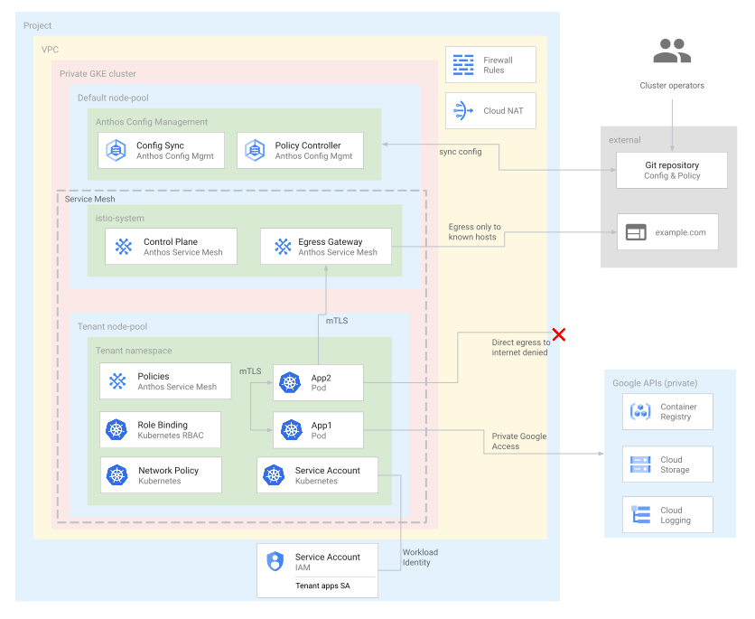

# Federated Learning on Google Cloud

This repository contains a blueprint that creates and secures a
[Google Kubernetes Engine](https://cloud.google.com/kubernetes-engine/docs/concepts/kubernetes-engine-overview)
(GKE) cluster that is ready to host custom apps distributed by a third party.

You can use this blueprint to implement Federated Learning (FL) use cases on
Google Cloud.

This blueprint suggests controls that you can use to help configure and secure
GKE clusters that host custom apps distributed by third-party tenants. These
custom apps are considered as untrusuted workloads within the cluster.
Therefore, the cluster is configured according to security best practices to
isolate and constrain the workloads from other workloads and from the cluster
control plane.

This blueprint provisions cloud resources on Google Cloud. After the initial provisioning,
you can extended the infrastructure to
[Anthos clusters running on premises or on other public clouds](https://cloud.google.com/anthos/clusters/docs/multi-cloud).

This blueprint is aimed at cloud platform administrator and data scientists that
need to provision and configure a secure environment to run potentially
untrusted workloads in their Google Cloud environment.

This blueprint assumes that you are familiar with GKE and
[Kubernetes](https://kubernetes.io/).

## Get started

To deploy this blueprint you need:

- A [Google Cloud project](https://cloud.google.com/docs/overview#projects) with billing enabled.
- An account with the [Project Owner role](https://cloud.google.com/iam/docs/understanding-roles#resource-manager-roles) on the project.
- The `serviceusage.googleapis.com` must be enabled on the project. For more
  information about enabling APIs, see
  [Enabling and disabling services](https://cloud.google.com/service-usage/docs/enable-disable)

You create the infastructure using Terraform. The blueprint uses a local [Terraform backend](https://www.terraform.io/docs/language/settings/backends/configuration.html),
but we recommend to configure a [remote backend](https://www.terraform.io/language/settings/backends/configuration#backend-types)
for anything other than experimentation.

## Understand the repository structure

This repository has the following key directories:

- `examples`: contains examples that build on top of this blueprint.
- `terraform`: contains the Terraform code used to create the project-level infrastructure and resources, for example a GKE cluster, VPC network, firewall rules etc. It also installs Anthos components into the cluster
- `configsync`: contains the cluster-level resources and configurations that are applied to your GKE cluster.
- `tenant-config-pkg`: a [kpt](https://kpt.dev/?id=overview) package that you can use as a template to configure new tenants in the GKE cluster.

## Architecture

The following diagram describes the architecture that you create with this
blueprint:


As shown in the preceding diagram, the blueprint helps you to create and
configure the following infrastructure components:

- A [Virtual Private Cloud (VPC) network](https://cloud.google.com/vpc/docs/vpc) and subnet.
- A [private GKE cluster](https://cloud.google.com/kubernetes-engine/docs/concepts/private-cluster-concept) that helps you:
  - Isolate cluster nodes from the internet.
  - Limit exposure of your cluster nodes and control plane to the internet by creating a private GKE cluster with [authorised networks](https://cloud.google.com/kubernetes-engine/docs/concepts/private-cluster-concept#overview).
  - Use shielded cluster nodes that use a hardened node image with the containerd runtime.
  - Enable [Dataplane V2](https://cloud.google.com/kubernetes-engine/docs/concepts/dataplane-v2) for optimised Kubernetes networking.
  - [Encrypt cluster secrets](https://cloud.google.com/kubernetes-engine/docs/how-to/encrypting-secrets) at the application layer.
- Dedicated GKE [node pools](https://cloud.google.com/kubernetes-engine/docs/concepts/node-pools).
  - You create a dedicated node pool to exclusively host tenant apps and resources. The nodes have taints to ensure that only tenant workloads are scheduled onto the tenant nodes.
  - Other cluster resources are hosted in the main node pool.
- [VPC Firewall rules](https://cloud.google.com/vpc/docs/firewalls)
  - Baseline rules that apply to all nodes in the cluster.
  - Additional rules that apply only to the nodes in the tenant node pool. These firewall rules limit ingress to and egress from tenant nodes.
- [Cloud NAT](https://cloud.google.com/nat/docs/overview) to allow egress to the internet
- [Cloud DNS](https://cloud.google.com/dns/docs/overview) records to enable [Private Google Access](https://cloud.google.com/vpc/docs/private-google-access) such that apps within the cluster can access Google APIs without traversing the internet.
- [Service Accounts](https://cloud.google.com/iam/docs/understanding-service-accounts):
  - Dedicated service account for the nodes in the tenant node pool.
  - Dedicated service account for tenant apps to use with Workload Identity.
- Support for using [Google Groups for Kubernetes RBAC](https://cloud.google.com/kubernetes-engine/docs/how-to/google-groups-rbac).
- A [Cloud Source Repository](https://cloud.google.com/source-repositories/docs) to store configuration descriptors.
- An [Artifact Registry](https://cloud.google.com/artifact-registry/docs) repository to store container images.

### Applications

The following diagram shows the cluster-level resources that you create and configure with the blueprint.



As shown in the preceding diagram, in the blueprint, you use the following to create and configure the cluster-level resources:

- Anthos Config Management [Config Sync](https://cloud.google.com/anthos-config-management/docs/config-sync-overview), to sync cluster configuration and policies from a Git repository.
  - When you provision the resources using this blueprint, the tooling initializes a Git repository for Config Sync to consume, and automatically renders the relevant templates and commits changes.
  - The tooling automatically commits any modification to templates in the Config Sync repository on each [run of the provisioning process](#deploy-the-blueprint).
- Anthos Config Management [Policy Controller](https://cloud.google.com/anthos-config-management/docs/concepts/policy-controller) enforces policies ('constraints') to enforce policies on resources in the cluster.
- [Anthos Service Mesh](https://cloud.google.com/service-mesh/docs/overview) to control and help secure network traffic.
- A dedicated namespace and node pools for tenant apps and resources. Custom apps are treated as a tenant within the cluster.
- Policies and controls applied to the tenant namespace:
  - Allow egress only to known hosts.
  - Allow requests that originate from within the same namespace.
  - By default, deny all ingress and egress traffic to and from pods. This acts as baseline 'deny all' rule.
  - Allow traffic between pods in the namespace.
  - Allow egress to required cluster resources such as: Kubernetes DNS, the service mesh control plane, and the GKE metadata server.
  - Allow egress to Google APIs only using Private Google Access.
  - Allow running host tenant pods on nodes in the dedicated tenant node pool exclusively.
  - Use a dedicated Kubernetes service account that is linked to a Cloud Identity and Access Management service account using [Workload Identity](https://cloud.google.com/kubernetes-engine/docs/how-to/workload-identity).

Users and teams managing tenant apps should not have permissions to change cluster configuration or modify service mesh resources

## Deploy the blueprint

1. Open [Cloud Shell](https://cloud.google.com/shell)
1. Clone this repository
1. Change into the directory that contains the Terraform code:

    ```sh
    cd [REPOSITORY]/terraform
    ```

    Where `[REPOSITORY]` is the path to the directory where you cloned this repository.

1. Initialize Terraform:

    ```sh
    terraform init
    ```

1. Initialize the following Terraform variables:

    ```hcl
    project_id          = # Google Cloud project ID where to provision resources with the blueprint.
    acm_repository_path = # Path on the host running Terraform to store the GKE descriptors to configure the cluster
    ```

    If you don't provide all the necessary inputs, Terraform will exit with an
    error, and will provide information about the missing inputs. For example,
    you can create a Terraform variables initialization file and set inputs there.
    For more information about providing these inputs, see
    [Terraform input variables](https://developer.hashicorp.com/terraform/language/values/variables).

1. Review the proposed changes, and apply them:

    ```sh
    terraform apply
    ```

    The provisioning process may take about 15 minutes to complete.

1. Wait for the GKE cluster to be reported as ready in the [GKE Kuberentes clusters dashboard](https://cloud.google.com/kubernetes-engine/docs/concepts/dashboards#kubernetes_clusters).

### Next steps

After deploying the blueprint completes, the GKE cluster is ready to host untrusted workloads.
To familiarize with the environment that you provisioned, you can also deploy
the following examples in the GKE cluster:

- [Distributed TensorFlow Federated training](./examples/federated-learning/tff/distributed-fl-simulation-k8s/README.md)

Federated learning is typically split into Cross-silo and Cross-device federated learning. Cross-silo federated computation is where the participating members are organizations or companies, and the number of members is usually small (e.g., within a hundred).

Cross-device computation is a type of federated computation where the participating members are end user devices such as mobile phones and vehicles. The number of members can reach up to a scale of millions or even tens of millions.

You can deploy a cross-device infrastructure by following [this README.md](./terraform/cross-device/README.md)

## Add another tenant

This blueprint dynamically provisions a runtime environment for each tenant you
configure.

To add another tenant:

1. Add its name to the list of tenants to configure using the `tenant_names` variable.
1. Follow the steps to [Deploy the blueprint](#deploy-the-blueprint) again.

## Connect to cluster nodes

To open an SSH session against a node of the cluster, you use an IAP tunnel
because cluster nodes don't have external IP addresses:

```sh
gcloud compute ssh --tunnel-through-iap node_name
```

Where `node_name` is the Compute Engine instance name to connect to.

## Troubleshooting

This section describes common issues and troubleshooting steps.

### I/O timeouts when running Terraform plan or apply

If Terraform reports errors when you run `plan` or `apply` because it can't get
the status of a resource inside a GKE cluster, and it also reports that it needs
to update the `cidr_block` of the `master_authorized_networks` block of that
cluster, it might be that the instance that runs Terraform is not part of any
CIDR that is authorized to connect to that GKE cluster control plane.

To solve this issue, you can try updating the `cidr_block` by targeting the GKE
cluster specifically when applying changes:

```sh
terraform apply -target module.gke
```

Then, you can try running `terraform apply` again, without any resource
targeting.

### Network address assignment errors when running Terraform

If Terraform reports `connect: cannot assign requested address` errors when
you run Terraform, try running the command again.

### Errors when adding the GKE cluster to the Fleet

If Terraform reports errors about the format of the fleet membership
configuration, it may mean that the Fleet API initialization didn't complete
when Terraform tried to add the GKE cluster to the fleet. Example:

```plain text
Error creating FeatureMembership: googleapi: Error 400: InvalidValueError for
field membership_specs["projects/<project number>/locations/global/memberships/<cluster name>"].feature_spec:
does not match a current membership in this project. Keys should be in the form: projects/<project number>/locations/{l}/memberships/{m}
```

If this error occurs, try running `terraform apply` again.

### Errors when pulling container images

If `istio-ingress` or `istio-egress` Pods fail to run because GKE cannot
download their container images and GKE reports `ImagePullBackOff` errors, see
[Troubleshoot gateways](https://cloud.google.com/service-mesh/docs/gateways#troubleshoot_gateways)
for details about the potential root cause. You can inspect the status of these
Pods in the
[GKE Workloads Dashboard](https://cloud.google.com/kubernetes-engine/docs/concepts/dashboards#workloads).

If this happens, wait for the cluster to complete the initialiazation, and
delete the Deployment that has this issue. Config Sync will deploy it again with
the correct container image identifiers.

## Understanding the security controls that you need

This section discusses the controls that you apply with the blueprint to help
you secure your GKE cluster.

### Enhanced security of GKE clusters

*Creating clusters according to security best practices.*

The blueprint helps you create a GKE cluster which
implements the following security settings:

- Limit exposure of your cluster nodes and control plane to the internet
    by creating a
    [private GKE cluster](https://cloud.google.com/kubernetes-engine/docs/concepts/private-cluster-concept)
    with
    [authorized networks](https://cloud.google.com/kubernetes-engine/docs/concepts/private-cluster-concept#overview).
- Use
    [shielded nodes](https://cloud.google.com/kubernetes-engine/docs/how-to/shielded-gke-nodes)
    that use a hardened node image with the
    [`containerd`](https://cloud.google.com/kubernetes-engine/docs/concepts/using-containerd)
    runtime.
- Increased isolation of tenant workloads using
    [GKE Sandbox](https://cloud.google.com/kubernetes-engine/docs/concepts/sandbox-pods).
- [Encrypt cluster secrets](https://cloud.google.com/kubernetes-engine/docs/how-to/encrypting-secrets)
    at the application layer.

For more information about GKE security settings, refer to
[Hardening your cluster's security](https://cloud.google.com/kubernetes-engine/docs/how-to/hardening-your-cluster).

### VPC firewall rules: Restricting traffic between virtual machines

[VPC firewall rules](https://cloud.google.com/vpc/docs/firewalls)
govern which traffic is allowed to or from Compute Engine VMs. The rules let
you filter traffic at VM granularity, depending on
[Layer 4](https://wikipedia.org/wiki/Transport_layer)
attributes.

You create a GKE cluster with the
[default GKE cluster firewall rules](https://cloud.google.com/kubernetes-engine/docs/concepts/firewall-rules#cluster-fws).
These firewall rules enable communication between the cluster nodes and
GKE control plane, and between nodes and Pods in the
cluster.

You apply additional firewall rules to the nodes in the tenant node pool. These
firewall rules restrict egress traffic from the tenant nodes. This approach lets
you increase the isolation of the tenant nodes. By default, all egress traffic
from the tenant nodes is denied. Any required egress must be explicitly
configured. For example, you use the blueprint to create firewall rules to allow
egress from the tenant nodes to the GKE control plane, and
to Google APIs using
[Private Google Access](https://cloud.google.com/vpc/docs/private-google-access).
The firewall rules are targeted to the tenant nodes using the tenant node pool
[service account](https://cloud.google.com/vpc/docs/firewalls#service-accounts-vs-tags).

<<_shared/_anthos_snippets/_anthos-blueprints-snippets-namespaces.md>>

The blueprint helps you create a dedicated namespace to host the third-party
apps. The namespace and its resources are treated as a tenant within
your cluster. You apply policies and controls to the namespace to limit the
scope of resources in the namespace.

### Network policies: Enforcing network traffic flow within clusters

[Network policies](https://kubernetes.io/docs/concepts/services-networking/network-policies/)
enforce Layer 4 network traffic flows by using Pod-level firewall rules. Network
policies are
[scoped to a namespace](https://cloud.google.com/anthos-config-management/docs/how-to/configs#network-policy-config).

In the blueprint, you apply network policies to the tenant namespace that
hosts the third-party apps. By default, the network policy denies all traffic to
and from pods in the namespace. Any required traffic must be explicitly
allowlisted. For example, the network policies in the blueprint explicitly
allow traffic to required cluster services, such as the cluster internal DNS and
the Anthos Service Mesh control plane.

### Config Sync: Applying configurations to your GKE clusters

[Config Sync](https://cloud.google.com/anthos-config-management/docs/config-sync-overview)
keeps your GKE clusters in sync with configs stored in a
Git
[repository](https://cloud.google.com/anthos-config-management/docs/how-to/repo).
The Git repository acts as the single source of truth for your cluster
configuration and policies. Config Sync is declarative. It continuously
checks cluster state and applies the state declared in the configuration file in
order to enforce policies, which helps to prevent
[configuration drift](https://cloud.google.com/anthos-config-management/docs/how-to/prevent-config-drift).

You install Config Sync into your GKE cluster. You
configure Config Sync to sync cluster configurations and policies from the
GitHub repository associated with the blueprint. The synced resources include
the following:

- Cluster-level Anthos Service Mesh configuration
- Cluster-level security policies
- Tenant namespace-level configuration and policy including network
    policies, service accounts, RBAC rules, and Anthos Service Mesh configuration

### Policy Controller: Enforcing compliance with policies

[Anthos Policy Controller](https://cloud.google.com/anthos-config-management/docs/concepts/policy-controller)
is a
[dynamic admission controller](https://kubernetes.io/docs/reference/access-authn-authz/extensible-admission-controllers/)
for Kubernetes that enforces
[CustomResourceDefinition-based (CRD-based)](https://kubernetes.io/docs/tasks/access-kubernetes-api/custom-resources/custom-resource-definitions/)
policies that are executed by the
[Open Policy Agent (OPA)](https://www.openpolicyagent.org/).

[Admission controllers](https://kubernetes.io/blog/2019/03/21/a-guide-to-kubernetes-admission-controllers/)
are Kubernetes plugins that intercept requests to the Kubernetes API server
before an object is persisted, but after the request is authenticated and
authorized. You can use admission controllers to limit how a cluster is used.

You install Policy Controller into your GKE cluster. The
blueprint includes example policies to help secure your cluster. You
automatically apply the policies to your cluster using Config Sync. You
apply the following policies:

- Selected policies to help
    [enforce Pod security](https://cloud.google.com/anthos-config-management/docs/how-to/using-constraints-to-enforce-pod-security).
    For example, you apply policies that prevent pods
    [running privileged containers](https://cloud.google.com/anthos-config-management/docs/how-to/using-constraints-to-enforce-pod-security#prevent-privileged-containers)
    and that require a
    [read-only root file system](https://cloud.google.com/anthos-config-management/docs/how-to/using-constraints-to-enforce-pod-security#require-readonly-rootfs).
- Policies from the Policy Controller
    [template library](https://cloud.google.com/anthos-config-management/docs/latest/reference/constraint-template-library).
    For example, you apply a policy that
    [disallows services with type NodePort](https://cloud.google.com/anthos-config-management/docs/latest/reference/constraint-template-library#k8sblocknodeport).

### Anthos Service Mesh: Managing secure communications between services

[Anthos Service Mesh](https://cloud.google.com/service-mesh/docs/overview)
helps you monitor and manage an
[Istio](https://istio.io/docs/concepts/what-is-istio/)-based
service mesh. A service mesh is an infrastructure layer that helps create managed,
observable, and secure communication across your services.

Anthos Service Mesh helps simplify the management of secure communications
across services in the following ways:

- Managing authentication and encryption of traffic
    ([supported protocols](https://cloud.google.com/service-mesh/docs/supported-features#protocol_support)
    within the cluster using
    [mutual Transport Layer Communication (mTLS)](https://cloud.google.com/service-mesh/docs/security-overview#mutual_tls)).
    Anthos Service Mesh manages the provisioning and rotation of mTLS keys and
    certificates for Anthos workloads without disrupting
    communications. Regularly rotating mTLS keys is a security best practice
    that helps reduce exposure in the event of an attack.
- Letting you configure network security policies based on service
    identity rather than on the IP address of a peers on the network. Anthos Service Mesh
    is used to configure identity-aware access control (firewall) policies that
    let you create security policies that are independent of the network location
    of the workload. This approach simplifies the process of setting up
    service-to-service communications policies.
- Letting you configure policies that permit access from certain clients.

The blueprint guides you to install Anthos Service Mesh in your cluster. You
configure the tenant namespace for
[automatic sidecar proxy injection](https://cloud.google.com/service-mesh/docs/proxy-injection).
This approach ensures that apps in the tenant namespace are part of the mesh.
You automatically configure Anthos Service Mesh using Config Sync. You
configure the mesh to do the following:

- Enforce
    [mTLS communication](https://cloud.google.com/service-mesh/docs/security/configuring-mtls#enforcing_mesh-wide_mtls)
    between services in the mesh.
- Limit outbound traffic from the mesh to only known hosts.
- Limit
    [authorized communication](https://cloud.google.com/service-mesh/docs/security/authorization-policy-overview)
    between services in the mesh. For example, apps in the tenant namespace are
    only allowed to communicate with apps in the same namespace, or with a
    set of known external hosts.
- Route all outbound traffic through a mesh gateway where you can apply
    further traffic controls.

### Node taints and affinities: Controlling workload scheduling

[Node taints](https://kubernetes.io/docs/concepts/scheduling-eviction/taint-and-toleration/)
and
[node affinity](https://kubernetes.io/docs/concepts/scheduling-eviction/assign-pod-node/#affinity-and-anti-affinity)
are Kubernetes mechanisms that let you influence how pods are scheduled onto
cluster nodes.

Tainted nodes repel pods. Kubernetes will not schedule a Pod onto a tainted
node unless the Pod has a *toleration* for the taint. You can use node taints to
reserve nodes for use only by certain workloads or tenants. Taints and
tolerations are often used in multi-tenant clusters. See the
[dedicated nodes with taints and tolerations](https://cloud.google.com/kubernetes-engine/docs/concepts/multitenancy-overview#dedicated_nodes_with_taints_and_tolerations)
documentation for more information.

Node affinity lets you constrain pods to nodes with particular labels. If a pod
has a node affinity requirement, Kubernetes will not schedule the Pod onto a
node unless the node has a label that matches the affinity requirement. You can
use node affinity to ensure that pods are scheduled onto appropriate nodes.

You can use node taints and node affinity together to ensure tenant workload
pods are scheduled exclusively onto nodes reserved for the tenant.

The blueprint helps you control the scheduling of the tenant apps in the
following ways:

- Creating a GKE node pool dedicated to the tenant.
    Each node in the pool has a taint related to the tenant name.
- Automatically applying the appropriate toleration and node affinity to
    any Pod targeting the tenant namespace. You apply the toleration and
    affinity using
    [PolicyController mutations](https://cloud.google.com/anthos-config-management/docs/how-to/mutation).

### Least privilege: Limiting access to cluster and project resources

It is a security best practice to adopt a principle of least privilege for your
Google Cloud projects and resources like GKE clusters. This
way, the apps that run inside your cluster, and the developers and operators
that use the cluster, have only the minimum set of permissions required.

The blueprint helps you use least privilege service accounts in the following
ways:

- Each GKE node pool receives its own service
    account. For example, the nodes in the tenant node pool use a service
    account dedicated to those nodes. The node service accounts are configured
    with the
    [minimum required permissions](https://cloud.google.com/kubernetes-engine/docs/how-to/hardening-your-cluster#use_least_privilege_sa).
- The cluster uses
    [Workload Identity](https://cloud.google.com/kubernetes-engine/docs/how-to/workload-identity)
    to associate Kubernetes service accounts with Google service accounts. This
    way, the tenant apps can be granted limited access to any required Google
    APIs without downloading and storing a service account key. For example,
    you can grant the service account permissions to read data from a
    Cloud Storage bucket.

The blueprint helps you
[restrict access to cluster resources](https://cloud.google.com/kubernetes-engine/docs/how-to/hardening-your-cluster#use_namespaces_and_rbac_to_restrict_access_to_cluster_resources)
in the following ways:

- You create a sample Kubernetes RBAC role with limited permissions to
    manage apps. You can grant this role to the users and groups who operate
    the apps in the tenant namespace. This way, those users only have
    permissions to modify app resources in the tenant namespace. They do not
    have permissions to modify cluster-level resources or sensitive security
    settings like Anthos Service Mesh policies.

## References

- [GKE hardening guide](https://cloud.google.com/kubernetes-engine/docs/how-to/hardening-your-cluster).
