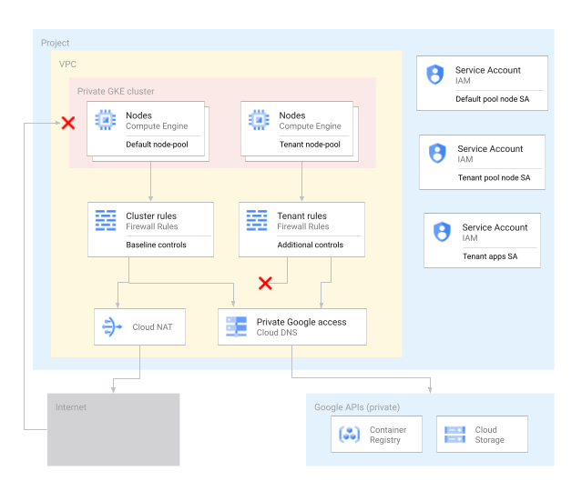
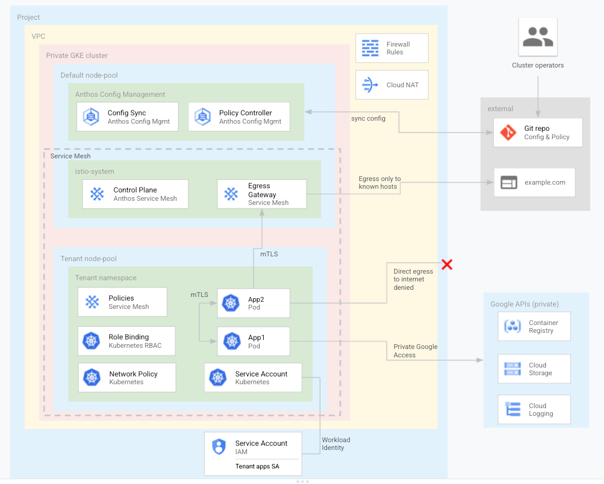

# Blueprint: Preparing a GKE cluster for apps distributed by a third party

This repository contains a blueprint that creates and secures a
[Google Kubernetes Engine](https://cloud.google.com/kubernetes-engine/docs/concepts/kubernetes-engine-overview)
(GKE) cluster that is ready to host custom apps distributed by a third party.
For more information about the architecture of this blueprint, refer to
[Preparing a GKE cluster for third-party tenants](https://cloud.google.com/architecture/preparing-gke-cluster-apps-distributed-third-party).

This blueprint uses a GKE cluster as the compute infrastructure to host
containerized apps distributed by a third party. These apps are considered as
untrusuted workloads within the cluster. Therefore, the cluster
is configured according to security best practices to isolate and constrain the
workloads from other workloads and from the cluster control plane. The blueprint
uses [Anthos](https://cloud.google.com/anthos) features to configure and secure
the cluster.

This blueprint provisions cloud resources on Google Cloud. After the initial provisioning,
you can extended the infrastructure to [Anthos clusters running on premises or on other public clouds](https://cloud.google.com/anthos/clusters/docs/multi-cloud).

This blueprint is aimed at cloud platform administrator and data scientists that
aim to provision and configure a secure environment to run potentially untrusted
workloads in their Google Cloud environment.

## Getting started

To deploy this blueprint you need:

- A [Google Cloud project](https://cloud.google.com/docs/overview#projects) with billing enabled
- An account with the [Project Owner role](https://cloud.google.com/iam/docs/understanding-roles#resource-manager-roles) on the project

You create the infastructure using Terraform. The blueprint uses a local [Terraform backend](https://www.terraform.io/docs/language/settings/backends/configuration.html),
but we recommend to configure a [remote backend](https://www.terraform.io/language/settings/backends/configuration#backend-types)
for anything other than experimentation.

## Understanding the repository structure

This repository has the following key directories:

- `examples`: contains examples that build on top of this blueprint.
- `terraform`: contains the Terraform code used to create the project-level infrastructure and resources, for example a GKE cluster, VPC network, firewall rules etc. It also installs Anthos components into the cluster
- `configsync`: contains the cluster-level resources and configurations that are applied to your GKE cluster.
- `tenant-config-pkg`: a [kpt](https://kpt.dev/?id=overview) package that you can use as a template to configure new tenants in the GKE cluster.

## Architecture

The blueprint uses a [multi-tenant](https://cloud.google.com/kubernetes-engine/docs/concepts/multitenancy-overview) architecture.

The workloads provided by third parties are treated as a tenant within the
cluster. Each tenant has its own dedicated Kubernetes namepsace and node pool.
Tenant workloads are grouped in their dedicated namespaces, and run in isolation
in their dedicated node pools. The blueprint applies security controls and
policies to the nodes and namespaces that host these workloads.

### Infrastructure

The following diagram describes the infrastructure created by the blueprint


The infrastructure provisioned by this blueprint includes:

- A [VPC network](https://cloud.google.com/vpc/docs/vpc) and subnet.
- A [private GKE cluster](https://cloud.google.com/kubernetes-engine/docs/concepts/private-cluster-concept). The blueprint helps you create GKE clusters that implement recommended security settings, such as those described in the [GKE hardening guide](https://cloud.google.com/kubernetes-engine/docs/how-to/hardening-your-cluster). For example, the blueprint helps you:
  - Limit exposure of your cluster nodes and control plane to the internet by creating a private GKE cluster with [authorised networks](https://cloud.google.com/kubernetes-engine/docs/concepts/private-cluster-concept#overview).
  - Use shielded nodes that use a hardened node image with the containerd runtime.
  - Enable [Dataplane V2](https://cloud.google.com/kubernetes-engine/docs/concepts/dataplane-v2) for optimised Kubernetes networking.
  - [Encrypt cluster secrets](https://cloud.google.com/kubernetes-engine/docs/how-to/encrypting-secrets) at the application layer.
- Two GKE [node pools](https://cloud.google.com/kubernetes-engine/docs/concepts/node-pools).
  - You create a dedicated node pool to exclusively host tenant apps and resources. The nodes have taints to ensure that only tenant workloads
  are scheduled onto the tenant nodes.
  - Other cluster resources are hosted in the main node pool.
- [VPC Firewall rules](https://cloud.google.com/vpc/docs/firewalls)
  - Baseline rules that apply to all nodes in the cluster.
  - Additional rules that apply only to the nodes in the tenant node pool (targeted using the node Service Account below). These firewall rules limit egress from the tenant nodes.
- [Cloud NAT](https://cloud.google.com/nat/docs/overview) to allow egress to the internet
- [Cloud DNS](https://cloud.google.com/dns/docs/overview) records to enable [Private Google Access](https://cloud.google.com/vpc/docs/private-google-access) such that apps within the cluster can access Google APIs without traversing the internet.
- [Service Accounts](https://cloud.google.com/iam/docs/understanding-service-accounts) used by the cluster.
  - A dedicated Service Account used by the nodes in the tenant node pool
  - A dedicated Service Account for use by tenant apps to use with Workload Identity.
- Support for using [Google Groups for Kubernetes RBAC](https://cloud.google.com/kubernetes-engine/docs/how-to/google-groups-rbac).
- A [Cloud Source Repository](https://cloud.google.com/source-repositories/docs) to store configuration descriptors.
- An [Artifact Registry](https://cloud.google.com/artifact-registry/docs) repository to store container images.

### Applications

The following diagram describes the apps and resources within the GKE cluster


The cluster includes:

- [Config Sync](https://cloud.google.com/anthos-config-management/docs/config-sync-overview), which keeps cluster configuration in sync with config defined in a Git repository.
  - When you provision the resources using this blueprint, the tooling initializes a Git repository for Config Sync to consume, and automatically renders the relevant templates and commits changes.
  - The tooling automatically commits any modification to templates in the Config Sync repository on each [run of the provisioning process](#deploy-the-blueprint).
- [Policy Controller](https://cloud.google.com/anthos-config-management/docs/concepts/policy-controller) enforces policies ('constraints') for your clusters. These policies act as 'guardrails' and prevent any changes to your cluster that violate security, operational, or compliance controls.
  - Example policies enforced by the blueprint include:
    - Selected constraints [similar to PodSecurityPolicy](https://cloud.google.com/anthos-config-management/docs/how-to/using-constraints-to-enforce-pod-security)
    - Selected constraints from the [template library](https://cloud.google.com/anthos-config-management/docs/reference/constraint-template-library), including:
      - Prevent creation of external services (Ingress, NodePort/LoadBalancer services)
      - Allow pods to pull container images only from a named set of repositories
  - See the resources in the [configsync/policycontroller](configsync/policycontroller) directory for details of the constraints applied by this blueprint.
- [Anthos Service Mesh](https://cloud.google.com/service-mesh/docs/overview) (ASM) is powered by Istio and enables managed, observable, and secure communication across your services. The blueprint includes service mesh configuration that is applied to the cluster using Config Sync. The following points describe how this blueprint configures the service mesh.
  - An Egress Gateway that acts a forward-proxy at the edge of the mesh in the `istio-egress` namespace.
  - The root istio namespace (istio-system) is configured with
    - PeerAuthentication resource to allow only STRICT mTLS communications between services in the mesh
    - AuthorizationPolicies that by default deny all communication between services in the mesh.
  - Tenant namespaces are configured for automatic sidecar proxy injection.
  - The mesh does not include an Ingress Gateway by default.

The blueprint configures a dedicated namespace for tenant apps and resources:

- The tenant namespace is part of the service mesh. Pods in the namespace receive sidecar proxy containers. The namespace-level mesh resources include:
  - Sidecar resource that allows egress only to known hosts (`outboundTrafficPolicy: REGISTRY_ONLY`).
  - AuthorizationPolicy that defines the allowed communication paths within the namespace. The blueprint only allows requests that originate from within the same namespace. This
  policy is added to the root policy in the istio-system namespace
- The tenant namespace has [network policies](https://cloud.google.com/kubernetes-engine/docs/how-to/network-policy) to limit traffic to and from pods in the namespace. For example, the network policy:
  - By default, denies all ingress and egress traffic to and from the pods. This acts as baseline 'deny all' rule.
  - Allows traffic between pods in the namespace.
  - Allows egress to required cluster resources like kube-dns, service mesh control plane and the GKE metadata server.
  - Allows egress to Google APIs (via Private Google Access).
- The pods in the tenant namespace are hosted exclusively on nodes in the dedicated tenant node pool.
  - Any pod deployed to the tenant workspace automatically receives a toleration and nodeAffinity to ensure that it is scheudled only a tenant node.
  - The toleration and node affinity are automatically applied using [Policy Controller mutations](https://cloud.google.com/anthos-config-management/docs/how-to/mutation)
- The apps in the tenant namespace use a dedicated Kubernetes service account that is linked to a Google Cloud service account using [Workload Identity](https://cloud.google.com/kubernetes-engine/docs/how-to/workload-identity). This way you can grant appropriate IAM roles to interact with any required Google APIs.
- The blueprint includes a [sample RBAC ClusterRole](configsync/rbac.yaml) that grants users permissions to interact with limited resource types. The tenant namespace includes a [sample RoleBinding](tenant-config-pkg/rbac.yaml) that grants the role to an example user.
  - Users and teams managing tenant apps should not have permissions to change cluster configuration or modify service mesh resources

## Deploy the blueprint

1. Open [Cloud Shell](https://cloud.google.com/shell)
1. Clone this repository
1. Change into the directory that contains the Terraform code:

  ```sh
  cd [REPOSITORY]/terraform
  ```

  Where `[REPOSITORY]` is the path to the directory where you cloned this repository.

1. Initialize Terraform:

  ```sh
  terraform init
  ```

1. Initialize the following Terraform variables:

  ```hcl
  project_id          = # Google Cloud project ID where to provision resources with the blueprint.
  acm_repository_path = # Path on the host running Terraform to store the GKE descriptors to configure the cluster
  ```

  If you don't provide all the necessary inputs, Terraform will exit with an
  error, and will provide information about the  missing inputs. For example,
  you can create a Terraform variables initialization file and set inputs there.
  For more information about providing these inputs, see
  [Terraform input variables](https://developer.hashicorp.com/terraform/language/values/variables).

1. Review the proposed changes, and apply them:

  ```sh
  terraform apply
  ```

  The provisioning process may take about 15 minutes to complete.

1. Wait for the GKE cluster to be reported as ready in the [GKE Kuberentes clusters dashboard](https://cloud.google.com/kubernetes-engine/docs/concepts/dashboards#kubernetes_clusters).

After the process completes, the GKE cluster is ready to host untrusted workloads.
To familiarize with the environment that you provisioned, you can also deploy
the following examples in the GKE cluster:

- [Distributed TensorFlow Federated training](./examples/federated-learning/tff/distributed-fl-simulation-k8s/README.md)

### Add another tenant

This blueprint dynamically provisions a runtime environment for each tenant you
configure.

To add another tenant:

1. Add its name to the list of tenants to configure using the `tenant_names` variable.
1. Follow the steps to [Deploy the blueprint](#deploy-the-blueprint) again.

## Connect to cluster nodes

To open an SSH session against a node of the cluster, you use an IAP tunnel
because cluster nodes don't have external IP addresses:

```sh
gcloud compute ssh --tunnel-through-iap node_name
```

Where `node_name` is the Compute Engine instance name to connect to.

## Troubleshooting

This section describes common issues and troubleshooting steps.

### I/O timeouts during Terraform plan or apply

If Terraform reports errors when running `plan` or `apply` because it can't get
the status of a resource inside a GKE cluster, and it also reports that it needs
to update the `cidr_block` of the `master_authorized_networks` block of that
cluster, it might be that the instance that runs Terraform is not part of any
CIDR that is authorized to connect to that GKE cluster control plane.

To solve this issue, you can try updating the `cidr_block` by targeting the GKE
cluster specifically when applying changes:

```sh
terraform apply -target module.gke
```

Then, you can try running `terraform apply` again, without any resource
targeting.

### Errors when adding the GKE cluster to the Fleet

If Terraform reports errors about the format of the fleet membership
configuration, it may mean that the Fleet API initialization didn't complete
when Terraform tried to add the GKE cluster to the fleet. Example:

```plain text
Error creating FeatureMembership: googleapi: Error 400: InvalidValueError for
field membership_specs["projects/<project number>/locations/global/memberships/<cluster name>"].feature_spec:
does not match a current membership in this project. Keys should be in the form: projects/<project number>/locations/{l}/memberships/{m}
```

If this error occurs, try running `terraform apply` again.

### Errors when pulling container images

If `istio-ingress` or `istio-egress` pods fail to run because GKE cannot
download their container images, see
[Troubleshoot gateways](https://cloud.google.com/service-mesh/docs/gateways#troubleshoot_gateways)
for details about the potential root cause.

If this happens, wait for the cluster to complete the initialiazation, and
delete the deployment that has this issue. Config Sync will deploy it again with
the correct container image identifiers.
