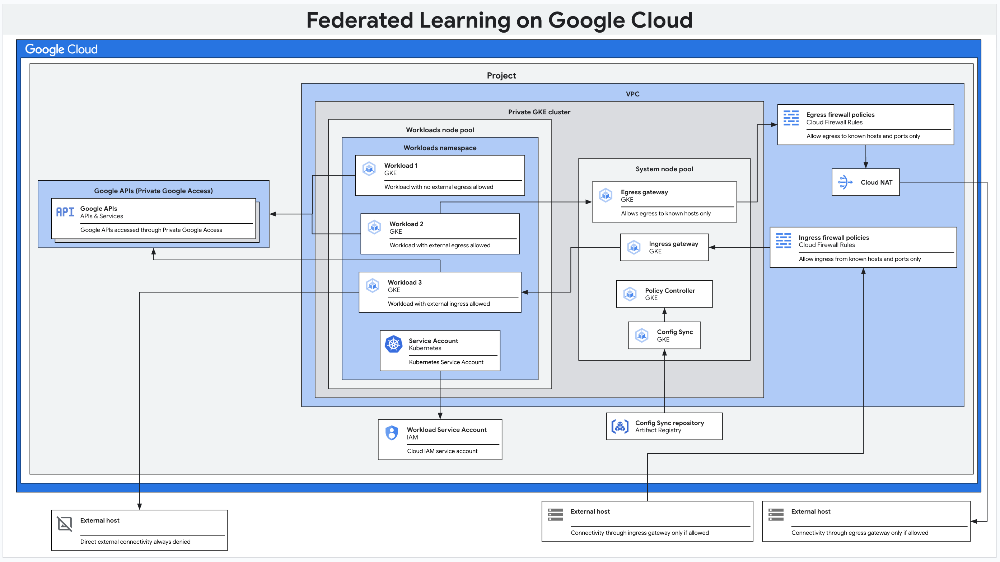

# Federated Learning on Google Cloud

This repository contains a reference architecture that creates and helps you
secure a Google Cloud environment that is ready for you to implement Federated
Learning (FL) use cases on Google Cloud.

This reference architecture is aimed at cloud platform administrators and data
scientists that need to provision and configure a secure environment to run FL
workloads in their Google Cloud environment.

This reference architecture implements controls that you can use to help
configure and secure your Google Cloud environment to host FL workloads.
Workloads are considered as untrusted within the Google Cloud environment.
Therefore, the cluster is configured according to isolate and FL workloads from
other workloads and from the cluster control plane. We recommend that you grant
only the required permissions that FL workloads need in order to work as
designed.

This reference architecture provisions resources on Google Cloud. The runtime
environment is based on
[Google Kubernetes Engine](https://cloud.google.com/kubernetes-engine/docs/concepts/kubernetes-engine-overview)
(GKE). After the initial provisioning, you can extended the infrastructure to
[GKE clusters running on premises or on other public clouds](https://cloud.google.com/kubernetes-engine/multi-cloud/docs).

This reference architecture assumes that you are familiar with GKE and
[Kubernetes](https://kubernetes.io/).

## Get started

To deploy this reference architecture you need:

- A [Google Cloud project](https://cloud.google.com/docs/overview#projects) with
  billing enabled.
- An account with either the [Project Owner role](#option-1-project-owner-role)
  (full access) or [Granular Access roles](#option-2-granular-access).
- The `serviceusage.googleapis.com` must be enabled on the project. For more
  information about enabling APIs, see
  [Enabling and disabling services](https://cloud.google.com/service-usage/docs/enable-disable)
- A Git repository to store the environment configuration.

### Service Account Roles & Permissions

You can choose between **Project Owner** access or **Granular Access** for more
fine-tuned permissions.

#### Option 1: Project Owner role

The service account will have full administrative access to the project.

- `roles/owner`: Full administrative access to the project
  ([Project Owner role](https://cloud.google.com/iam/docs/understanding-roles#resource-manager-roles))

#### Option 2: Granular Access

The service account will be assigned the following roles to limit access to
required resources:

- **`roles/artifactregistry.admin`**: Grants full administrative access to
  Artifact Registry, allowing management of repositories and artifacts.
- **`roles/browser`**: Provides read-only access to browse resources in a
  project.
- **`roles/cloudkms.admin`**: Provides full administrative control over Cloud
  KMS (Key Management Service) resources.
- **`roles/compute.networkAdmin`**: Grants full control over Compute Engine
  network resources.
- **`roles/container.clusterAdmin`**: Provides full control over Kubernetes
  Engine clusters, including creating and managing clusters.
- **`roles/gkehub.editor`**: Grants permission to manage Google Kubernetes
  Engine Hub features.
- **`roles/iam.serviceAccountAdmin`**: Grants full control over managing service
  accounts in the project.
- **`roles/resourcemanager.projectIamAdmin`**: Allows managing IAM policies and
  roles at the project level.
- **`roles/servicenetworking.serviceAgent`**: Allows managing service networking
  configurations.
- **`roles/serviceusage.serviceUsageAdmin`**: Grants permission to enable and
  manage services and APIs for a project.

## Architecture

The following diagram describes the architecture that you create with this
reference architecture:



As shown in the preceding diagram, the reference architecture helps you create
and configure the following infrastructure components:

- A [Virtual Private Cloud (VPC) network](https://cloud.google.com/vpc/docs/vpc)
  and subnets.

- A
  [private GKE cluster](https://cloud.google.com/kubernetes-engine/docs/concepts/private-cluster-concept)
  that helps you:

  - Isolate cluster nodes from the internet.
  - Limit exposure of your cluster nodes and control plane to the internet.
  - Use shielded GKE nodes.
  - Enable
    [Dataplane V2](https://cloud.google.com/kubernetes-engine/docs/concepts/dataplane-v2)
    for optimized Kubernetes networking.
  - [Encrypt cluster secrets](https://cloud.google.com/kubernetes-engine/docs/how-to/encrypting-secrets)
    at the application layer.

- Dedicated GKE
  [node pools](https://cloud.google.com/kubernetes-engine/docs/concepts/node-pools)
  to isolate workloads from each other in dedicated runtime environments.

- For each GKE node pool, the reference architecture creates a dedicated
  Kubernetes namespace. The Kubernetes namespace and its resources are treated
  as a tenant within the GKE cluster.

- For each GKE node, the reference architecture configures Kubernetes taints to
  ensure that only the tenant's workloads are schedulable onto the GKE nodes
  belonging to a particular tenant.

- A GKE node pool (`system`) to host coordination and management workloads that
  aren't tied to specific tenants.

- [Firewall policies](https://cloud.google.com/firewall/docs/firewall-policies-overview)
  to limit ingress and egress traffic from GKE node pools, unless explicitly
  allowed.

- [Cloud NAT](https://cloud.google.com/nat/docs/overview) to allow egress
  traffic to the internet, only if allowed.

- [Cloud DNS](https://cloud.google.com/dns/docs/overview) records to enable
  [Private Google Access](https://cloud.google.com/vpc/docs/private-google-access)
  such that workloads within the cluster can access Google APIs without
  traversing the internet.

- [Cloud Identity and Access Management (IAM) service accounts](https://cloud.google.com/iam/docs/understanding-service-accounts):

  - A service account for GKE nodes in each GKE node pool with only the
    [minimum amount of permissions needed by GKE](https://cloud.google.com/kubernetes-engine/docs/how-to/hardening-your-cluster#use_least_privilege_sa).
  - A service account for workloads in each tenant. These service don't have any
    permission by default, and map to Kubernetes service accounts using
    [Workload Identity for GKE](https://cloud.google.com/kubernetes-engine/docs/how-to/workload-identity).

- An [Artifact Registry](https://cloud.google.com/artifact-registry/docs)
  repository to store container images for your workloads.

- [Config Sync](https://cloud.google.com/kubernetes-engine/enterprise/config-sync/docs/overview)
  to sync cluster configuration and policies from a Git repository or an
  OCI-compliant repository. Users and teams managing workloads should not have
  permissions to change cluster configuration or modify service mesh resources
  unless explicitly allowed by your policies.

- An Artifact Registry repository to store Config Sync configurations.

- [Policy Controller](https://cloud.google.com/kubernetes-engine/enterprise/policy-controller/docs/overview)
  to enforce policies on resources in the GKE cluster to help you isolate
  workloads.

- [Cloud Service Mesh](https://cloud.google.com/service-mesh/docs/overview) to
  control and help secure network traffic.

Config Sync applies the following Policy controller and Cloud Service Mesh
controls to each Kubernetes namespace:

- By default, deny all ingress and egress traffic to and from pods. This rule
  acts as baseline 'deny all' rule.
- Allow egress traffic to required cluster resources such as the GKE control
  plane.
- Allow egress traffic only to known hosts.
- Allow ingress and egress traffic that originate from within the same
  namespace.
- Allow ingress and egress traffic between pods in the same namespace.
- Allow egress traffic to Google APIs only using Private Google Access.

## Deploy the reference architecture

1. Open [Cloud Shell](https://cloud.google.com/shell)

1. Clone this Git repository, including submodules:

   ```sh
   git clone --recurse-submodules git@github.com:GoogleCloudPlatform/federated-learning.git
   ```

   If you prefer cloning using the repository web URL, run this command instead:

   ```sh
   git clone --recurse-submodules https://github.com/GoogleCloudPlatform/federated-learning.git
   ```

1. Change into the directory where you cloned this repository:

   ```sh
   cd federated-learning
   ```

1. Configure the ID of the Google Cloud project where you want to initialize the
   provisioning and configuration environment. This project will also contain
   the remote Terraform backend. Add the following content to
   `accelerated-platforms/platforms/gke/base/_shared_config/terraform.auto.tfvars`:

   ```hcl
   terraform_project_id = "<CONFIG_PROJECT_ID>"
   ```

   Where:

   - `<CONFIG_PROJECT_ID>` is the Google Cloud project ID.

1. Configure the ID of the Google Cloud project where you want to deploy the
   reference architecture by adding the following content to
   `accelerated-platforms/platforms/gke/base/_shared_config/cluster.auto.tfvars`:

   ```hcl
   cluster_project_id = "<PROJECT_ID>"
   ```

   Where:

   - `<PROJECT_ID>` is the Google Cloud project ID. Can be different from
     `<CONFIG_PROJECT_ID>`.

1. Optionally configure a unique identifier to append to the name of all the
   resources in the reference architecture to identify a particular instance of
   the reference architecture, and to allow for multiple instances of the
   reference architecture to be deployed in the same Google Cloud project. To
   optionally configure the unique prefix, add the following content to
   `accelerated-platforms/platforms/gke/base/_shared_config/platform.auto.tfvars`:

   ```hcl
   resource_name_prefix = "<RESOURCE_NAME_PREFIX>"
   platform_name        = "<PLATFORM_NAME>"
   ```

   Where:

   - `<RESOURCE_NAME_PREFIX>` and `<PLATFORM_NAME>` are strings that compose the
     unique identifier to append to the name of all the resources in the
     reference architecture.

   When you set `resource_name_prefix` and `platform_name`, we recommend that
   you avoid long strings because the might make resource naming validation to
   fail because the resource name might be too long.

1. Run the script to deploy the reference architecture:

   ```sh
   accelerated-platforms/platforms/gke/base/use-cases/federated-learning/deploy.sh
   ```

   It takes about 20 minutes to provision the reference architecture.

### Next steps

After deploying the reference architecture completes, the GKE cluster is ready
to host FL workloads. To familiarize with the environment that you provisioned,
you can also deploy the following examples in the GKE cluster:

- [NVIDIA FLARE example](https://github.com/GoogleCloudPlatform/accelerated-platforms/blob/main/platforms/gke/base/use-cases/federated-learning/examples/nvflare-tff/README.md)

Federated computation in FL use cases is typically defined as either:

- Cross-silo federated computation is where the participating members are
  organizations or companies, and the number of members is usually small (e.g.,
  within a hundred). You can realize cross-silo FL use cases by configuring this
  reference architecture, and by deploying FL workloads in the GKE cluster that
  this reference architecture provides.
- Cross-device computation is a type of federated computation where the
  participating members are end user devices such as mobile phones and vehicles.
  The number of members can reach up to a scale of millions or even tens of
  millions. You can deploy a cross-device infrastructure by following
  [this README.md](./terraform/cross-device/README.md)

## Configure the reference architecture

For more information about configuring this reference architecture, see
[Configure the Federated Learning reference architecture](https://github.com/GoogleCloudPlatform/accelerated-platforms/tree/main/platforms/gke/base/use-cases/federated-learning#configure-the-federated-learning-reference-architecture).

## Troubleshooting

For more information about how to troubleshoot issue, see
[Troubleshooting the reference architecture](https://github.com/GoogleCloudPlatform/accelerated-platforms/tree/main/platforms/gke/base/use-cases/federated-learning#troubleshooting).

## Understanding security controls

For more information about the controls that this reference architecture
implements to help you secure your environment, see
[GKE security controls](https://cloud.google.com/architecture/cross-silo-cross-device-federated-learning-google-cloud).

## What's next

For a complete overview about how to implement Federated Learning on Google
Cloud, see
[Cross-silo and cross-device federated learning on Google Cloud](https://cloud.google.com/architecture/cross-silo-cross-device-federated-learning-google-cloud).
