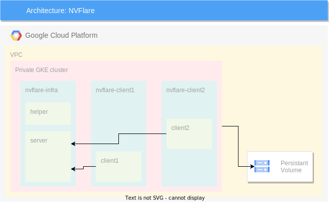

# NVFlare with TensorFlow

This example uses NVFlare to train an image classifier using federated averaging and TensorFlow as the deep learning framework.

[NVIDIA FLARE](https://nvflare.readthedocs.io/en/main/index.html) (**NV**IDIA **F**ederated **L**earning **A**pplication **R**untime **E**nvironment)
is a domain-agnostic, open-source, extensible SDK that allows researchers and data scientists to adapt existing ML/DL workflows to a federated paradigm.
It enables platform developers to build a secure, privacy-preserving offering for a distributed multi-party collaboration.

[Here](https://nvflare.readthedocs.io/en/main/flare_overview.html#high-level-system-architecture) is a high level system architecture of NVFlare.

This example builds on top of the infrastructure that the
[blueprint provides](../../../../README.md), and follows the best practices the
blueprint establishes.

## Architecture

The following diagram shows one server and two clients that are connected to the server through a secure gRPC link:



As shown in the preceding diagram, the blueprint helps you to create and configure the following infrastructure components:

- A persistent volume to store the NVFlare workspace
- Two pods that are the clients that will be connected to the server in the nvidia-client1 and nvidia-client2 namespaces respectively
- One pod that is the the server that will aggregate all the results from the computation in the nvflare-infra namespace

## Deploy the blueprint

This example builds on top of the infrastructure that the
[blueprint provides](../../../../README.md), and follows the best practices the
blueprint establishes.

To deploy the NVFlare demo described in this document, you need to deploy the [Federated learning blueprint](../../../../README.md#deploy-the-blueprint) first. Then, you can deploy the NVFlare demo described in this document.

### Build and push the example container image

You have to create a custom image with TensorFlow and NVFlare installed. From the main `terraform` folder:

1. Open [Cloud Shell](https://cloud.google.com/shell)

1. Build the example container image locally on your host:

   ```bash
   NVFLARE_EXAMPLE_CONTAINER_IMAGE_REPOSITORY_HOSTNAME="$(terraform output -raw container_image_repository_fully_qualified_hostname)"
   NVFLARE_EXAMPLE_CONTAINER_IMAGE_LOCALIZED_ID="${NVFLARE_EXAMPLE_CONTAINER_IMAGE_REPOSITORY_HOSTNAME}/$(terraform output -raw container_image_repository_name)/nvflare-tensorflow"
   NVFLARE_EXAMPLE_CONTAINER_IMAGE_BUILD_CONTEXT_PATH="../examples/federated-learning/tff/nvflare/container-image"
   export NVFLARE_EXAMPLE_CONTAINER_IMAGE_TAG="0.0.1"
   NVFLARE_EXAMPLE_CONTAINER_IMAGE_LOCALIZED_ID_WITH_TAG=${NVFLARE_EXAMPLE_CONTAINER_IMAGE_LOCALIZED_ID}:${NVFLARE_EXAMPLE_CONTAINER_IMAGE_TAG}
   export NVFLARE_EXAMPLE_CONTAINER_IMAGE_LOCALIZED_ID

   docker build \
     --file "${NVFLARE_EXAMPLE_CONTAINER_IMAGE_BUILD_CONTEXT_PATH}/Dockerfile" \
     --tag "${NVFLARE_EXAMPLE_CONTAINER_IMAGE_LOCALIZED_ID_WITH_TAG}" \
     ${NVFLARE_EXAMPLE_CONTAINER_IMAGE_BUILD_CONTEXT_PATH}
   ```

   It takes about 8GBs of persistant storage space and can take up to 20 minutes to build. For a production deployment, consider using Cloud Build.

1. Authenticate Docker with the Artifact Registry repository:

   ```bash
   gcloud auth configure-docker \
       "${NVFLARE_EXAMPLE_CONTAINER_IMAGE_REPOSITORY_HOSTNAME}"
   ```

1. Push the container image to the Artifact Registry repository:

   ```bash
   docker image push "${NVFLARE_EXAMPLE_CONTAINER_IMAGE_LOCALIZED_ID_WITH_TAG}"
   ```

### Create the infrastructure to store the models

All the models generated will be stored in a Cloud storage bucket mounted by each pod.

1. Initialize the following Terraform variables:

   ```hcl
   nvflare               = true
   workspace_bucket_name = # Bucket name that will contain nvflare workspace
   ```

   The bucket name has to be unique.
   For example, you can generate a unique name for your bucket with the following command:

   ```bash
   RANDOM_SUFFIX=$(echo $RANDOM | md5sum | head -c 4; echo;)
   echo "nvflare-storage-${RANDOM_SUFFIX}"
   ```

1. Deploy the infrastructure for NVFlare

   ```bash
   terraform apply
   ```

### Create NVFlare folder structure

Now that the persistent volume is created, you can start creating the folder structure and upload it to Cloud Storage.

1. Use the NVFlare image previously built on your workstation:

   ```bash
   docker run --rm -v ${HOME}/nvflare-workspace:/opt/NVFlare/workspace -it ${NVFLARE_EXAMPLE_CONTAINER_IMAGE_LOCALIZED_ID_WITH_TAG} bash
   ```

1. Run the provisioning tool:

   ```bash
   nvflare provision
   ```

   You have to choose the non-ha (non high-availability) choice, as ha (high-availability) is not yet supported on Kubernetes. It will create a `project.yml` file that you can customize for your needs.

1. Re-run the provisioning tool inside the container:

   ```bash
   nvflare provision
   ls workspace/example_project/prod_00/
   ```

   The different folders generated represent the infrastructure you will deploy on the reference architecture:

   - `server1` is the server that will aggregate all the results from the computation
   - `site-1` and `site-2` are the clients that will be connected to the server
   - `admin@nvidia.com` is the administration client to start and list jobs

### Download NVFlare release

You will need to download the NVFlare release that contains the job you will run on the reference architecture:

1. Download NVFlare release

   ```bash
   wget -qO- https://github.com/NVIDIA/NVFlare/archive/refs/tags/2.4.2.tar.gz | tar xvz
   ```

   In the newly create folder, there is an `examples` folder that contains lots of demo you can use to test NVFlare. The TensorFlow demo is in the `examples/hello-world/hello-tf2`. The job will need to be in a special folder inside the `admin@nvidia.com` called the `transfer` folder to be deployed on each client participating in the computation.

1. Copy this folder in the `transfer` folder of the `admin@nvidia.com` folder:

   ```bash
   cp -R NVFlare-2.4.2/examples/hello-world/hello-tf2 workspace/example_project/prod_00/admin@nvidia.com/transfer
   ```

1. Exit the container with the `exit`command

   ```bash
   exit
   ```

1. Copy the whole workspace folder in Cloud Storage.

   ```bash
   gcloud storage -m cp -r ${HOME}/nvflare-workspace/workspace gs://${NVFLARE_WORKSPACE_BUCKET_NAME}
   ```

### Deploy the infrastructure

Everything is now setup to be able to submit the job.

1. Create the ConfigSync folder that will deploy the workload

   ```bash
   ACM_CONFIG_SYNC_PATH=$(terraform output -raw acm_config_sync_tenants_configuration_destination_directory_path)
   mkdir -p ${ACM_CONFIG_SYNC_PATH}/nvflare/base-storage
   ```

1. Modify the `pv-workspace.yaml.tpl` file to replace the bucket name:

   ```bash
   NVFLARE_WORKSPACE_BUCKET_NAME="\"$(terraform output -raw nvflare_workspace_bucket_name)\""
   export NVFLARE_WORKSPACE_BUCKET_NAME
   envsubst < ../examples/federated-learning/tff/nvflare/templates/pv-workspace.yaml.tpl > ${ACM_CONFIG_SYNC_PATH}/nvflare/base-storage/pv-workspace.yaml
   ```

1. Regenerate the `kustomization.yaml` file with all the necessary informations:

   ```bash
   NVFLARE_EXAMPLE_WORKLOADS_KUBERNETES_NAMESPACE="$(terraform output -raw nvflare_namespace)"
   export NVFLARE_EXAMPLE_WORKLOADS_KUBERNETES_NAMESPACE
   envsubst < ../examples/federated-learning/tff/nvflare/templates/pv-workspace.yaml.tpl > ${ACM_CONFIG_SYNC_PATH}/nvflare/base-storage/pv-workspace.yaml
   ```

1. Modify the `kustomization.yaml.tpl` file to add the new name and new tag of the image:

   ```bash
   envsubst < ../examples/federated-learning/tff/nvflare/templates/kustomization.yaml.tpl > ${ACM_CONFIG_SYNC_PATH}/kustomization.yaml
   ```

1. Deploy the infrastructure via ConfigSync:

   ```bash
   cp -a ../examples/federated-learning/tff/nvflare/workload-pkg/. ${ACM_CONFIG_SYNC_PATH}/nvflare
   ```

1. Commit everything in the ConfigSync repository to trigger reconciliation. From the ConfigSync repository:

   ```bash
   git -C ${ACM_CONFIG_SYNC_PATH} add nvflare/
   git -C ${ACM_CONFIG_SYNC_PATH} add kustomization.yaml
   git -C ${ACM_CONFIG_SYNC_PATH} commit -m "feat: add nvflare demo"
   git -C ${ACM_CONFIG_SYNC_PATH} push
   ```

   ConfigSync will get the last commit, hydrate the Kubernetes manifests based on your input in the `kustomization.yaml` and deploy everything in the cluster.

   You should end up with the following running pods:

   ```bash
   CLUSTER_NAME=$(terraform output -raw cluster_name)
   LOCATION=$(terraform output -raw cluster_location)
   NVFLARE_NAMESPACE=$(terraform output -raw nvflare_namespace)
   gcloud container clusters get-credentials $CLUSTER_NAME --location $LOCATION
   kubectl -n $NVFLARE_NAMESPACE get pods

   NAME                               READY   STATUS    RESTARTS   AGE
   nvflare-client1-57d5b45d84-bmv58   1/1     Running   0          16h
   nvflare-client2-895b65d8f-p4fs9    1/1     Running   0          16h
   nvflare-server1-66c44ddb47-dhtqz   1/1     Running   0          16h
   ```

   1. Alternatively, you can open the [GKE Workloads Dashboard](https://cloud.google.com/kubernetes-engine/docs/concepts/dashboards#workloads) and look at the workloads deployed.

### Submit the job

Everything is now ready to submit and run the job.

1. Use the NVFlare image previously built on your workstation:

   ```bash
   docker run --rm -v ${HOME}/nvflare-workspace:/opt/NVFlare/workspace -it ${NVFLARE_EXAMPLE_CONTAINER_IMAGE_LOCALIZED_ID_WITH_TAG} bash
   ```

1. Go to the `admin@nvidia.com` folder and connect to the infrastructure. When prompted, the username is `admin@nvidia.com`:

   ```bash
   cd workspace/example_project/prod_00/admin@nvidia.com/startup
   ./fl_admin.sh
   ```

   You should be connected to the federated learning system:

   ```bash
   User Name: admin@nvidia.com
   Trying to obtain server address
   Obtained server address: server1:8003
   Trying to login, please wait ...
   Logged into server at server1:8003 with SSID: ebc6125d-0a56-4688-9b08-355fe9e4d61a
   Type ? to list commands; type "? cmdName" to show usage of a command.
   >
   ```

   When connected, you can list the jobs submitted to the cluster by using the `list_jobs` command.

1. Type the command `submit_job` with the name of the job you want to run, here `hello-tf2`:

   ```bash
   > submit_job hello-tf2
   Submitted job: c8973f05-8787-41c5-8568-ecc15c7683b2
   Done [262650 usecs] 2024-05-23 09:47:04.543903
   ```

   The job should be running now:

   ```bash
   > list_jobs
   -----------------------------------------------------------------------------------------------------------------------------
   | JOB ID                               | NAME      | STATUS             | SUBMIT TIME                      | RUN DURATION   |
   -----------------------------------------------------------------------------------------------------------------------------
   | c8973f05-8787-41c5-8568-ecc15c7683b2 | hello-tf2 | RUNNING            | 2024-05-23T09:47:04.488652+00:00 | 0:00:11.978134 |
   -----------------------------------------------------------------------------------------------------------------------------
   Done [136046 usecs] 2024-05-23 09:47:17.630953
   ```

1. Verify the job ran successfully with the `list_jobs` command:

   ```bash
   > list_jobs
   -----------------------------------------------------------------------------------------------------------------------------
   | JOB ID                               | NAME      | STATUS             | SUBMIT TIME                      | RUN DURATION   |
   -----------------------------------------------------------------------------------------------------------------------------
   | c8973f05-8787-41c5-8568-ecc15c7683b2 | hello-tf2 | FINISHED:COMPLETED | 2024-05-23T09:47:04.488652+00:00 | 0:01:44.335456 |
   -----------------------------------------------------------------------------------------------------------------------------
   Done [56885 usecs] 2024-05-23 09:49:15.420097
   ```

1. You can exit the container and inspect the logs of both the server and the clients:

   ```bash
   kubectl logs deploy/nvflare-client1

   2024-05-23 09:47:05,450 - ClientEngine - INFO - Starting client app. rank: 0
   2024-05-23 09:47:05,583 - ProcessExecutor - INFO - Worker child process ID: 128
   2024-05-23 09:47:05,589 - ProcessExecutor - INFO - run (c8973f05-8787-41c5-8568-ecc15c7683b2): waiting for child worker process to finish.
   ...
   2024-05-23 09:47:30,727 - Communicator - INFO - Received from example_project server. getTask: train size: 408.5KB (408512 Bytes) time: 0.100075 seconds
   2024-05-23 09:47:30,728 - FederatedClient - INFO - pull_task completed. Task name:train Status:True
   2024-05-23 09:47:30,728 - ClientRunner - INFO - [identity=site-1, run=c8973f05-8787-41c5-8568-ecc15c7683b2, peer=example_project, peer_run=c8973f05-8787-41c5-8568-ecc15c7683b2]: got task assignment: name=train, id=eec461ea-c475-4c39-a52a-db666c51680e
   2024-05-23 09:47:30,729 - ClientRunner - INFO - [identity=site-1, run=c8973f05-8787-41c5-8568-ecc15c7683b2, peer=example_project, peer_run=c8973f05-8787-41c5-8568-ecc15c7683b2, task_name=train, task_id=eec461ea-c475-4c39-a52a-db666c51680e]: invoking task executor SimpleTrainer
   Epoch 1/2
   938/938 [==============================] - 12s 12ms/step - loss: 0.3942 - accuracy: 0.8868 - val_loss: 0.2465 - val_accuracy: 0.9282
   Epoch 2/2
   938/938 [==============================] - 8s 8ms/step - loss: 0.1873 - accuracy: 0.9459 - val_loss: 0.1844 - val_accuracy: 0.9418
   ...
   2024-05-23 09:48:42,128 - ClientRunner - INFO - [identity=site-1, run=c8973f05-8787-41c5-8568-ecc15c7683b2, peer=example_project, peer_run=c8973f05-8787-41c5-8568-ecc15c7683b2, task_name=train, task_id=ee34fd97-84a0-4d03-b15e-941e9e44eba6]: task result sent to server
   ...
   2024-05-23 09:48:44,144 - FederatedClient - INFO - Shutting down client run: site-1
   2024-05-23 09:48:44,321 - ClientRunner - INFO - [identity=site-1, run=c8973f05-8787-41c5-8568-ecc15c7683b2]: Client is stopping ...
   2024-05-23 09:48:44,331 - ReliableMessage - INFO - shutdown reliable message monitor
   2024-05-23 09:48:45,832 - MPM - INFO - MPM: Good Bye!
   2024-05-23 09:48:48,477 - ProcessExecutor - INFO - run (c8973f05-8787-41c5-8568-ecc15c7683b2): child worker process finished with RC 0
   ```
